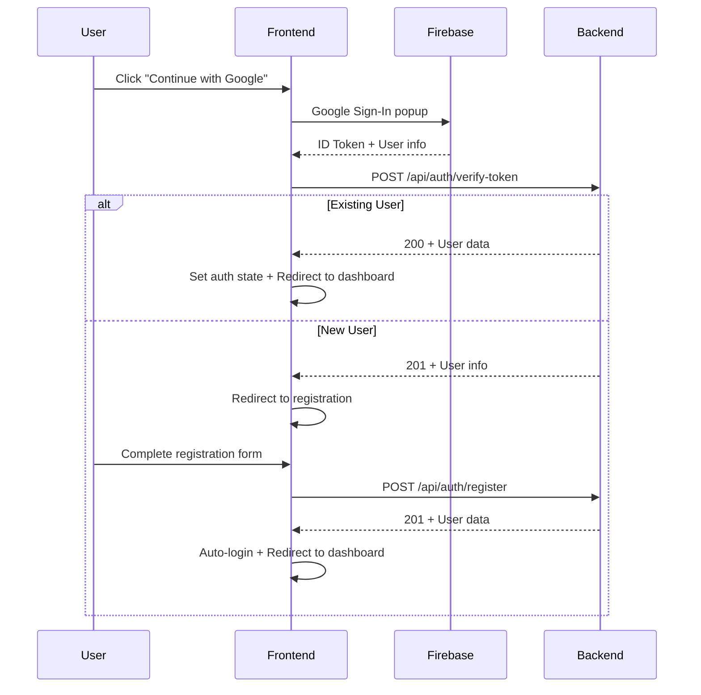

# 2nd Innings - Admin Web Portal

A comprehensive Vue.js 3 admin web application for the Second Innings project, featuring Firebase authentication, role-based access control, and advanced user management capabilities.

**Live Demo:** **[https://second-innings-iitm-admin.vercel.app/](https://second-innings-iitm-admin.vercel.app/)**

## 🚀 Features

### 🔐 Authentication & Security

- **Firebase Google Sign-In**: Secure authentication using Google OAuth
- **JWT Token Verification**: Backend token validation with `/api/auth/verify-token`
- **Automatic Session Management**: Persistent login state with local storage
- **Role-Based Access Control**: Dynamic navigation and feature access based on user roles
- **Route Protection**: Navigation guards preventing unauthorized access

### 👥 User Management & Roles

#### **Admin/Officials**
- 📊 **Dashboard**: Overview of platform statistics and metrics
- 👤 **User Management**: Create, edit, block/unblock support users
- 🎫 **Ticket System**: View and manage all support tickets
- 📝 **Interest Group Oversight**: Review and approve IGA applications
- 👨‍⚕️ **Caregiver Management**: Approve/reject caregiver applications
- 🔔 **Notifications**: System-wide notification management
- 👤 **Profile Management**: Admin profile settings

#### **Support Users**
- 🏠 **Support Dashboard**: Ticket overview and metrics
- 🎫 **Ticket Management**: View, reply to, and resolve support tickets
- 👤 **Profile Management**: Support user profile settings

#### **Interest Group Admins (IGAs)**
- 🏠 **IGA Dashboard**: Group management overview with status-based access
- 👥 **Group Management**: Create, edit, and manage interest groups (active users only)
- 📊 **Member Analytics**: View group membership and engagement statistics
- ⏳ **Status Management**: Pending approval, active, and blocked states
- 🎬 **YouTube Integration**: Video URL submission for verification
- 🏷️ **Tags & Description**: Categorization and description management
- 👤 **Enhanced Profile**: Role-specific profile with YouTube content extraction

### 🎨 User Interface & Experience

- **Responsive Design**: Mobile-first Bootstrap 5 components
- **Role-Adaptive Navigation**: Dynamic sidebar and navbar based on user permissions
- **Status-Based UI**: Conditional feature access with helpful messaging
- **Interactive Components**: Tag management, status badges, and progress indicators
- **Modern Styling**: Clean, professional interface with consistent theming

## 🏗️ Technical Architecture

### **Frontend Stack**
- **Vue.js 3**: Composition API with `<script setup>` syntax
- **Vite**: Fast development server and build tool
- **Pinia**: State management for user authentication and app state
- **Vue Router**: Client-side routing with navigation guards
- **Bootstrap 5**: UI components and responsive grid system
- **SCSS**: Advanced styling with modern Sass API

### **Authentication Flow**


### **Project Structure**
```
src/
├── components/
│   ├── common/          # Reusable components
│   │   ├── AppLayout.vue       # Main admin layout
│   │   ├── AppNavbar.vue       # Unified navigation bar
│   │   ├── AppSidebar.vue      # Dynamic sidebar navigation
│   │   └── RoleBasedLayout.vue # Role-adaptive layout wrapper
│   ├── layouts/         # Role-specific layouts
│   │   ├── IgaLayout.vue       # Interest Group Admin layout
│   │   └── SupportLayout.vue   # Support user layout
│   └── ui/              # UI components
│       ├── DataTable.vue       # Data table component
│       └── StatCard.vue        # Statistics card component
├── config/
│   ├── api.js           # API configuration and endpoints
│   └── firebase.js      # Firebase configuration
├── services/
│   ├── apiService.js    # HTTP client wrapper
│   ├── firebaseAuth.js  # Firebase authentication service
│   ├── userService.js   # User management and profile service
│   └── mockData.js      # Development mock data
├── stores/
│   ├── auth.js          # Authentication state management
│   ├── notifications.js # Notification state
│   ├── officials.js     # Admin user management
│   └── tickets.js       # Support ticket management
├── utils/
│   ├── apiResponse.js   # API response handling utilities
│   └── sessionManager.js # Session validation and management
├── views/
│   ├── admin/           # Admin-specific views
│   ├── auth/            # Authentication views
│   ├── caregivers/      # Caregiver management views
│   ├── iga/             # Interest Group Admin views
│   └── support/         # Support user views
└── router/
    └── index.js         # Route definitions and guards
```

## 🔧 Environment Setup

### **Prerequisites**
- Node.js 16+
- npm or yarn
- Firebase project with Google Authentication enabled

### **Installation**

1. **Clone the repository**
   ```bash
   git clone <repository-url>
   cd admin_web
   ```

2. **Install dependencies**
   ```bash
   npm install
   ```

3. **Environment Configuration**
   ```bash
   # Create .env file
   cp .env.example .env

   # Configure environment variables
   VITE_API_BASE_URL=http://localhost:8000  # Development API URL
   VITE_FIREBASE_API_KEY=your_firebase_api_key
   VITE_FIREBASE_AUTH_DOMAIN=your_project.firebaseapp.com
   VITE_FIREBASE_PROJECT_ID=your_project_id
   ```

### **Development**

```bash
# Start development server
npm run dev

# Server will start at http://localhost:3000
```

### **Production Build**

```bash
# Build for production
npm run build

# Preview production build
npm run preview
```

### **Code Quality**

```bash
# Run ESLint
npm run lint

# Fix lint issues
npm run lint:fix
```

## 🔑 API Endpoints

### **Authentication**
- `POST /api/auth/verify-token` - Verify Firebase ID token
- `POST /api/auth/register` - Register new IGA user

### **User Management**
- `POST /api/user/profile` - Get user profile with status

### **Environment Configuration**
- **Development**: `http://localhost:8000`
- **Production**: `https://second-innings-iitm-249726620429.asia-south1.run.app`

## 🎯 User Status Management

### **Interest Group Admin Statuses**

| Status | Description | Access Level |
|--------|-------------|--------------|
| `pending_approval` | Application under review | Dashboard view only, no group management |
| `active` | Approved and operational | Full access to all features |
| `blocked` | Access restricted | No access, contact support |

### **Status-Based Features**

- **Pending Approval**:
  - ⚠️ Dashboard shows review information
  - ⚠️ Profile editing disabled
  - ⚠️ Group management hidden from navigation
  - ⚠️ Helpful guidance on approval process

- **Active**:
  - ✅ Full dashboard with statistics
  - ✅ Complete group management capabilities
  - ✅ Profile editing enabled
  - ✅ All navigation items visible

## 🎨 UI/UX Features

- **Dynamic Navigation**: Menu items adapt based on user role and status
- **Status Indicators**: Clear badges and alerts for user status
- **Responsive Design**: Works seamlessly on desktop, tablet, and mobile
- **Interactive Elements**: Tag management, status toggles, data tables
- **Loading States**: Smooth loading indicators and skeleton screens
- **Error Handling**: User-friendly error messages and fallbacks

## 🛠️ Development Tools

- **Vue DevTools**: Browser extension for Vue.js debugging
- **ESLint**: Code linting with Vue.js specific rules
- **Prettier**: Code formatting (integrated with ESLint)
- **Vite HMR**: Hot module replacement for fast development

## 📝 Contributing

1. Fork the repository
2. Create a feature branch (`git checkout -b feature/amazing-feature`)
3. Commit your changes (`git commit -m 'Add amazing feature'`)
4. Push to the branch (`git push origin feature/amazing-feature`)
5. Open a Pull Request

## 📋 License

This project is part of the Second Innings initiative for senior citizen engagement and community building.

---

**Built with ❤️ for the Second Innings community**
