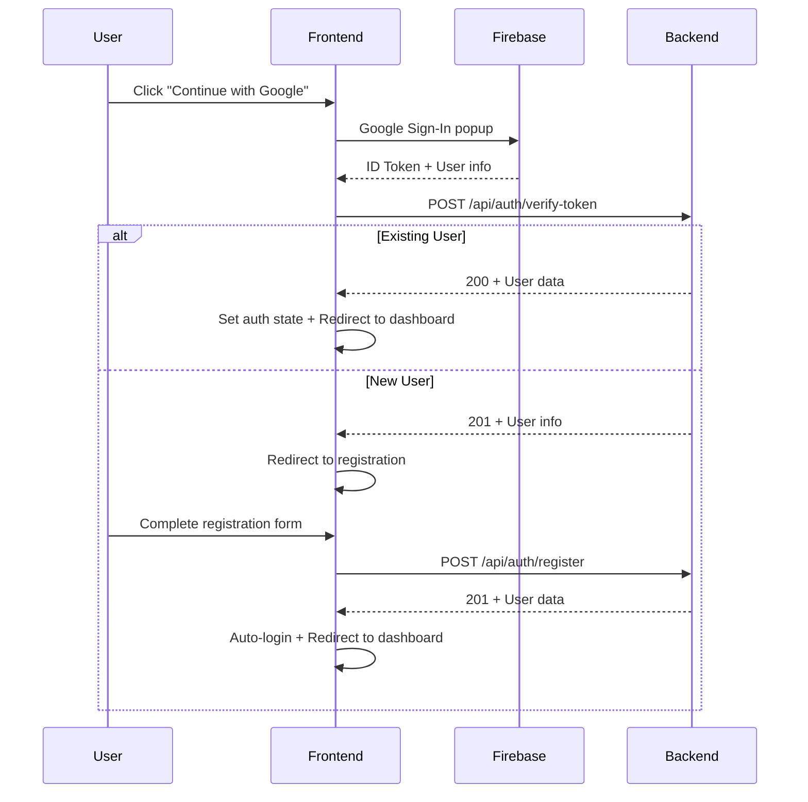
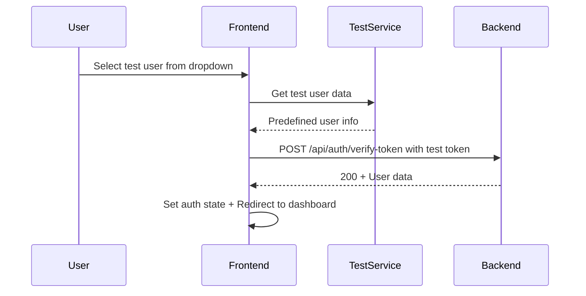

# 2nd Innings - Admin Web Portal

A comprehensive Vue.js 3 admin web application for the Second Innings project, featuring Firebase authentication, role-based access control, and advanced user management capabilities.

**Live Demo:** **[https://second-innings-iitm-admin.vercel.app/](https://second-innings-iitm-admin.vercel.app/)**

## 🚀 Features

### 🔐 Authentication & Security

- **Firebase Google Sign-In**: Secure authentication using Google OAuth
- **Test Mode Support**: Development/testing mode with predefined users
- **JWT Token Verification**: Backend token validation with `/api/auth/verify-token`
- **Automatic Session Management**: Persistent login state with local storage
- **Role-Based Access Control**: Dynamic navigation and feature access based on user roles
- **Route Protection**: Navigation guards preventing unauthorized access

### 👥 User Management & Roles

#### **Admin/Officials**
- 📊 **Dashboard**: Overview of platform statistics and metrics
- 👤 **User Management**: Create, edit, block/unblock support users
- 🎫 **Ticket System**: View and manage all support tickets
- 📝 **Interest Group Oversight**: Review and approve IGA applications
- 👨‍⚕️ **Caregiver Management**: Approve/reject caregiver applications
- 👨‍👩‍👧‍👦 **Family Member Management**: Manage family member accounts
- 👴 **Senior Citizen Management**: Oversee senior citizen accounts
- 🔔 **Notifications**: System-wide notification management
- 👤 **Profile Management**: Admin profile settings

#### **Support Users**
- 🏠 **Support Dashboard**: Ticket overview and metrics
- 🎫 **Ticket Management**: View, reply to, and resolve support tickets
- 👤 **Profile Management**: Support user profile settings

#### **Interest Group Admins (IGAs)**
- 🏠 **IGA Dashboard**: Group management overview with status-based access
- 👥 **Group Management**: Create, edit, and manage interest groups (active users only)
- 📊 **Member Analytics**: View group membership and engagement statistics
- ⏳ **Status Management**: Pending approval, active, and blocked states
- 🎬 **YouTube Integration**: Video URL submission for verification
- 🏷️ **Tags & Description**: Categorization and description management
- 👤 **Enhanced Profile**: Role-specific profile with YouTube content extraction

#### **Caregivers**
- 👨‍⚕️ **Caregiver Dashboard**: Care service management and metrics
- 👥 **Client Management**: Manage senior citizen clients
- 📋 **Service Records**: Track care services and schedules
- 👤 **Profile Management**: Caregiver profile and verification status

#### **Family Members**
- 👨‍👩‍👧‍👦 **Family Dashboard**: Senior citizen family management
- 👴 **Senior Management**: Monitor and support senior family members
- 📞 **Communication Tools**: Connect with caregivers and support
- 👤 **Profile Management**: Family member profile settings

#### **Senior Citizens**
- 👴 **Senior Dashboard**: Personal care and community engagement
- 👥 **Care Services**: Access to caregiver services
- 🏘️ **Community Groups**: Join interest groups and activities
- 👤 **Profile Management**: Senior citizen profile settings

### 🧪 Testing & Development

- **Test Mode**: Bypass Firebase authentication with predefined test users
- **14 Predefined Test Users**: Covering all roles and statuses with story-based characters
- **Story-Based Scenarios**: Realistic family care management, caregiver services, and community activities
- **Development Workflow**: Easy testing of different user scenarios
- **Environment Configuration**: Simple test mode activation

### 🎭 Story-Based Test Characters

The test mode includes realistic story characters for comprehensive testing:

#### **Asha & Rohan Family Story**
- **Asha** (ID 3): 80-year-old Indian woman with kind eyes, short grey hair, and glasses. Enjoys gardening and staying active.
- **Rohan** (ID 4): Her 45-year-old son, professional Indian man with short black hair and grey streaks at temples. Caring son managing his mother's care.
- **Priya** (ID 5): 28-year-old Indian woman with warm smile and long dark hair in ponytail. Specializes in physiotherapy and companionship.
- **Mr. Verma** (ID 6): 70-year-old retired Indian gentleman with cheerful demeanor, neat white mustache, and glasses. Community leader organizing activities for seniors.

#### **Realistic Test Scenarios**
- Family care management between Rohan and Asha
- Caregiver services provided by Priya
- Community groups organized by Mr. Verma (Sunrise Walkers Club, Laughter Yoga, Garden Lovers, etc.)
- Support tickets and notifications for various scenarios
- Interest group activities and member management

### 🎨 User Interface & Experience

- **Responsive Design**: Mobile-first Bootstrap 5 components
- **Role-Adaptive Navigation**: Dynamic sidebar and navbar based on user permissions
- **Status-Based UI**: Conditional feature access with helpful messaging
- **Interactive Components**: Tag management, status badges, and progress indicators
- **Modern Styling**: Clean, professional interface with consistent theming

## 🏗️ Technical Architecture

### **Frontend Stack**
- **Vue.js 3**: Composition API with `<script setup>` syntax
- **Vite**: Fast development server and build tool
- **Pinia**: State management for user authentication and app state
- **Vue Router**: Client-side routing with navigation guards
- **Bootstrap 5**: UI components and responsive grid system
- **SCSS**: Advanced styling with modern Sass API
- **Axios**: HTTP client for API communication
- **Vue Toast Notifications**: User feedback system

### **Authentication Flow**


### **Test Mode Flow**


### **Project Structure**
```
src/
├── components/
│   ├── common/          # Reusable components
│   │   ├── AppLayout.vue       # Main admin layout
│   │   ├── AppNavbar.vue       # Unified navigation bar
│   │   ├── AppSidebar.vue      # Dynamic sidebar navigation
│   │   └── RoleBasedLayout.vue # Role-adaptive layout wrapper
│   ├── layouts/         # Role-specific layouts
│   │   ├── IgaLayout.vue       # Interest Group Admin layout
│   │   └── SupportLayout.vue   # Support user layout
│   └── ui/              # UI components
│       ├── DataTable.vue       # Data table component
│       └── StatCard.vue        # Statistics card component
├── config/
│   ├── api.js           # API configuration and endpoints
│   └── firebase.js      # Firebase configuration
├── services/
│   ├── apiService.js    # HTTP client wrapper
│   ├── firebaseAuth.js  # Firebase authentication service
│   ├── testAuthService.js # Test mode authentication service
│   ├── adminService.js  # Admin-specific API services
│   ├── userService.js   # User management and profile service
│   ├── officialsService.js # Officials management API services
│   ├── notificationsService.js # Notifications API services
│   └── ticketsService.js # Tickets API services
├── stores/
│   ├── auth.js          # Authentication state management
│   ├── notifications.js # Notification state
│   ├── officials.js     # Admin user management
│   └── tickets.js       # Support ticket management
├── utils/
│   ├── apiResponse.js   # API response handling utilities
│   └── sessionManager.js # Session validation and management
├── views/
│   ├── admin/           # Admin-specific views
│   ├── auth/            # Authentication views
│   ├── caregivers/      # Caregiver management views
│   ├── iga/             # Interest Group Admin views
│   └── support/         # Support user views
└── router/
    └── index.js         # Route definitions and guards
```

## 🔧 Environment Setup

### **Prerequisites**
- Node.js 16+
- npm or yarn
- Firebase project with Google Authentication enabled

### **Installation**

1. **Clone the repository**
   ```bash
   git clone <repository-url>
   cd admin_web
   ```

2. **Install dependencies**
   ```bash
   npm install
   ```

3. **Environment Configuration**
   ```bash
   # Create .env file
   cp .env.example .env
   ```

### **Development**

```bash
# Start development server
npm run dev

# Server will start at http://localhost:3000
```

### **Test Mode Setup**

For development and testing:

1. **Enable test mode**
   ```bash
   # In .env file
   VITE_TEST_MODE=true
   ```

2. **Backend test mode**
   ```bash
   # Ensure backend also has TEST_MODE=true
   ```

3. **Use predefined test users**
   - 14 test users across all roles
   - Different statuses (ACTIVE, PENDING_APPROVAL)
   - No Firebase authentication required

### **Production Build**

```bash
# Build for production
npm run build

# Preview production build
npm run preview
```

### **Code Quality**

```bash
# Run ESLint
npm run lint

# Fix lint issues
npm run lint:fix
```

## 🔑 API Endpoints

### **Authentication**
- `POST /api/auth/verify-token` - Verify Firebase ID token or test token
- `POST /api/auth/register` - Register new user

### **Admin Management**
- `GET /api/admin/users` - Get all users
- `DELETE /api/admin/users/:id` - Delete user
- `GET /api/admin/caregivers` - Get caregiver applications
- `POST /api/admin/caregivers/:id/verify` - Verify caregiver
- `GET /api/admin/interest-group-admins` - Get IGA applications
- `POST /api/admin/interest-group-admins/:id/verify` - Verify IGA
- `GET /api/admin/stats` - Get admin statistics

### **User Management**
- `POST /api/user/profile` - Get user profile with status

### **Environment Configuration**
- **Development**: `http://localhost:8000`
- **Production**: `https://second-innings-iitm-249726620429.asia-south1.run.app`

## 🎯 User Status Management

### **User Statuses**

| Status | Description | Access Level |
|--------|-------------|--------------|
| `ACTIVE` | Fully operational | Full access to all features |
| `PENDING_APPROVAL` | Application under review | Limited access, dashboard view only |
| `BLOCKED` | Access restricted | No access, contact support |

### **Role-Specific Features**

#### **Interest Group Admin Statuses**
- **Pending Approval**: Dashboard view only, no group management
- **Active**: Full access to all features
- **Blocked**: No access, contact support

#### **Caregiver Statuses**
- **Pending Approval**: Application review required
- **Active**: Full caregiver service access
- **Blocked**: Access restricted

### **Status-Based Features**

- **Pending Approval**:
  - ⚠️ Dashboard shows review information
  - ⚠️ Profile editing disabled
  - ⚠️ Management features hidden from navigation
  - ⚠️ Helpful guidance on approval process

- **Active**:
  - ✅ Full dashboard with statistics
  - ✅ Complete management capabilities
  - ✅ Profile editing enabled
  - ✅ All navigation items visible

## 🧪 Test Mode Features

### **Available Test Users**

- **Admin Users**: 2 active admins
- **Support Users**: 2 active support users
- **Interest Group Admins**: 1 active, 1 pending
- **Caregivers**: 1 active, 1 pending
- **Family Members**: 2 active family members
- **Senior Citizens**: 2 active senior citizens
- **Unregistered Users**: 2 users for testing registration

### **Test Mode Benefits**

- **No Firebase Setup Required**: Bypass authentication for development
- **Quick Role Testing**: Test all user roles instantly
- **Status Testing**: Test different user statuses
- **Development Workflow**: Faster development and testing cycles

## 🎨 UI/UX Features

- **Dynamic Navigation**: Menu items adapt based on user role and status
- **Status Indicators**: Clear badges and alerts for user status
- **Responsive Design**: Works seamlessly on desktop, tablet, and mobile
- **Interactive Elements**: Tag management, status toggles, data tables
- **Loading States**: Smooth loading indicators and skeleton screens
- **Error Handling**: User-friendly error messages and fallbacks
- **Toast Notifications**: Real-time user feedback

## 🛠️ Development Tools

- **Vue DevTools**: Browser extension for Vue.js debugging
- **ESLint**: Code linting with Vue.js specific rules
- **Prettier**: Code formatting (integrated with ESLint)
- **Vite HMR**: Hot module replacement for fast development
- **Test Mode**: Development testing without Firebase setup

## 📝 Contributing

1. Fork the repository
2. Create a feature branch (`git checkout -b feature/amazing-feature`)
3. Commit your changes (`git commit -m 'Add amazing feature'`)
4. Push to the branch (`git push origin feature/amazing-feature`)
5. Open a Pull Request

## 📋 License

This project is part of the Second Innings initiative for senior citizen engagement and community building.

---

**Built with ❤️ for the Second Innings community**
